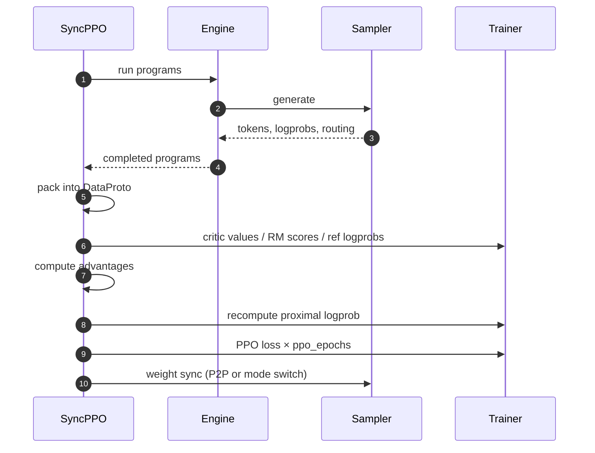

# Architecture

How Axon's components fit together — the whole system in one page, and the place to start if you're new. A run is something you assemble — an agent, an algorithm, a cluster, a model; the rest of this page is the machinery that turns it into training steps.

## Subsystems

Four subsystems, communicating through Ray actors and a typed data structure called `DataProto`.

- **Driver** (`axon/driver/`) orchestrates a training step. Two variants: `SyncPPO` runs Programs on the controller; `AsyncPPO` runs Programs on the sampler worker so rollout overlaps with training.
- **Trainer** (`axon/trainer/`) runs the model's forward, backward, and optimizer step. Two backends — FSDP and Megatron-Core — composed at runtime via mixins, so backend × topology × driver (sync or async, with async running disaggregated) is one set of classes.
- **Sampler** (`axon/sampler/`) runs rollout inference on a pinned vLLM fork. The fork carries the precision-parity patches and routing-replay capture used by the sampler-trainer agreement.
- **Engine** (`axon/engine/`) is the agent-execution layer: multi-turn rollouts, partial-rollout suspend/resume, tokenization, and an optional OpenAI-compatible HTTP surface.

`DataProto` (`axon/protocol.py`) is the typed batch that flows between subsystems. `TensorDict` for tensors, numpy arrays for non-tensor fields, with batch concatenation, padding, device movement, and inter-actor transfer.

## Two execution modes

The same code runs in two topologies, controlled by a single configuration flag.

- **Hybrid (`hybrid_engine: true`)**: Trainer and sampler share the same GPUs. Each step alternates between training and inference; weight sync is done by mode switching. Simpler, lower latency, the default for math, code, and agentic recipes that fit on a single node.

- **Disaggregated (`hybrid_engine: false`)**: Trainer and sampler run on disjoint GPU pools. Weight sync is done by NCCL P2P over RDMA: the trainer sends parameter slices directly to the sampler's GPUs through an explicit "bridge" process group. A `RoutingTable` (`axon/utils/p2p/`) handles the head/group arithmetic when actor TP and sampler TP differ. Higher throughput, used for the largest recipes.

The mode is selected at config time. The trainer and sampler classes are *the same Python classes* in either mode — only the mixins composed in differ:

```python
# axon/driver/train_agent_ppo.py — runtime worker class synthesis
if hybrid:
    trainer_mixins.append(FSDPSyncTrainerMixin if is_fsdp else MegatronSyncTrainerMixin)
if not hybrid or use_async:
    trainer_mixins.append(FSDPTrainerP2PMixin if is_fsdp else MegatronTrainerP2PMixin)
if use_async:
    trainer_mixins.append(AsyncTrainerMixin)
TrainerWorker = type(base.__name__, (*mixins, base), {})
```

One class hierarchy serves every backend × topology × driver combination (async runs disaggregated). Cross-cutting changes — a new loss, a checkpointing fix, a weight-sync transport — land once.

## Two driver modes

The driver controls *where* the rollout work runs.

- **`SyncPPO`** (`axon/driver/sync_ppo.py`) runs Programs on the controller. The controller drives the engine, gathers outputs, runs critic / reference-policy / KL enrichment, computes advantages, and dispatches the training step. Use this for recipes that need a value head or curriculum sampling.
- **`AsyncPPO`** (`axon/driver/async_ppo.py`) runs Programs on the sampler worker. A producer thread on the controller pushes lightweight requests to the sampler, which generates and pushes batches into a bounded queue. The trainer consumes from the queue. Use this for GRPO / DAPO / CISPO recipes where rollout time dominates and you want it to overlap with training.

Both share the same mixin-composed worker classes underneath; the choice is a recipe config.

## Programs

A program is what one rollout is. `BaseProgram` is the extension point; the shipped `ReactProgram` is the concrete program for ReAct-style multi-turn loops (math, code, FrozenLake, search, SWE, tool-using recipes). ReactProgram uses `BaseAgent` and `BaseEnv` as helpers for prompt construction and environment transitions. Custom programs that don't fit the React shape — parallel solvers, multi-agent, search trees — subclass `BaseProgram` directly and don't need an Agent or Environment at all (`recipes/parallel_thinker/` is the worked example).

[Programs, agents, and tools →](programs-agents-and-tools.md) covers the full picture, including the tool-call parser library, reusable reward functions, and external integrations.

## Configuration

Axon uses [Hydra](https://hydra.cc). The root `axon/config/config.yaml` pulls in the trainer template — once per role (actor, reference, critic, reward model) — and the sampler template through its `defaults:` block; a recipe overrides them from its own yaml or on the command line:

```bash
axon train -- strategy=megatron loss=cispo advantage=grpo hybrid_engine=false
```

`validate_config.py` runs at startup and fails fast on the common misconfigurations, with an actionable error, before any GPU memory is touched. The [Configuration reference](../reference/configuration.md) documents every knob.

## Where things live

| Subsystem | Files you should know |
|---|---|
| Driver | `axon/driver/sync_ppo.py`, `async_ppo.py`, `base.py`, `train_agent_ppo.py` |
| Trainer | `axon/trainer/fsdp_trainer.py`, `megatron_trainer.py`, `mixins/{sync,async,p2p}_mixin.py` |
| Algorithms | `axon/trainer/algos/loss/loss.py`, `algos/advantages/advantage.py` |
| Sampler | `axon/sampler/sampler.py`, `vllm/engine.py`, `mixins/`, `p2p/` |
| Engine | `axon/engine/engine.py`, `state/` |
| Programs / agents / envs | `axon/programs/{base_program.py, react_program.py}`, `axon/core/{agent.py, env.py}` |
| Models | `axon/models/{fsdp_models,megatron_models}.py`, `mbridge/`, `transformers/` |
| Patches | `axon/monkey_patches/{vllm,sglang,megatron,fsdp,transformers,torch}/` |
| Protocol | `axon/protocol.py` |
| CLI | `axon/cli/{train.py, _commands.py}` |
| Config | `axon/config/{config.yaml, trainer/, sampler/, validate_config.py}` |

## A complete training step (sync mode)



Async mode follows the same flow with a producer/consumer pattern between sampler and trainer; weights sync after the optimizer step, with rollout overlapping training through a bounded queue.

## Where to go next

- [Execution modes](execution-modes.md) — hybrid vs disaggregated, sync vs async, in detail.
- [Sampler-trainer agreement](sampler-trainer-agreement.md) — logprob alignment.
- [Parallelism and performance](parallelism.md) — 6D parallelism, memory knobs, custom kernels.
- [Programs, agents, and tools](programs-agents-and-tools.md) — programs, agents, environments, tools, integrations.
