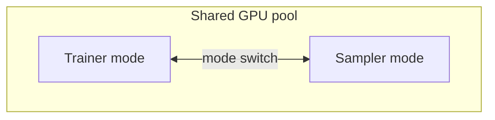
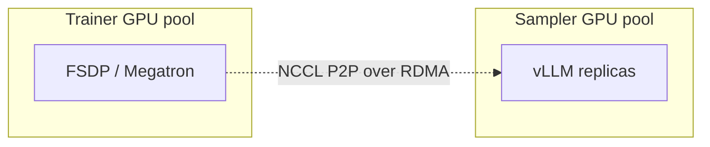
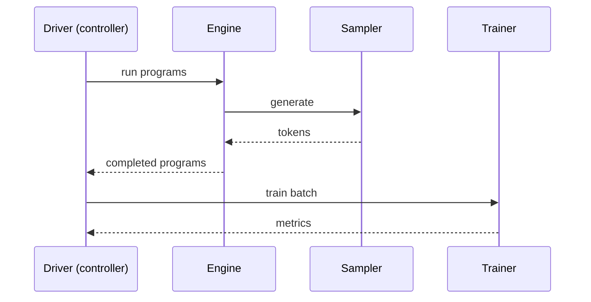
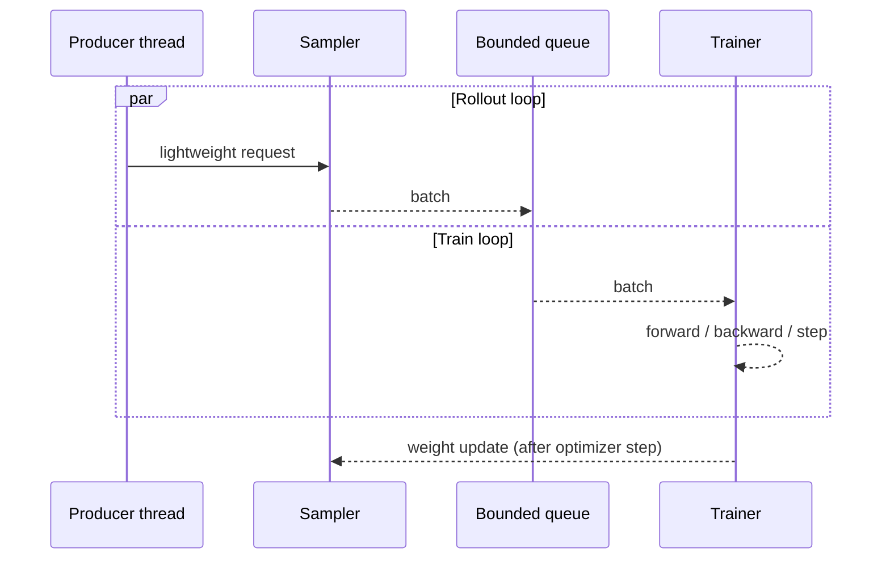

# Execution modes

Two choices describe how training and rollout are laid out:

- **Topology**: hybrid (colocated) vs disaggregated (separate GPU pools).
- **Driver**: sync (programs on controller) vs async (programs on sampler worker).

(The training backend itself — FSDP vs Megatron-Core — is a separate choice; see [Parallelism and performance](parallelism.md).) The combinations are the same Python classes; the mixins composed in at runtime differ.

## Topology — hybrid vs disaggregated

### Hybrid engine (`hybrid_engine: true`)

Trainer and sampler share the same GPUs. Each step alternates between training and inference; the weight sync between the two is an in-place mode switch — the trainer hands its current state dict to the sampler in the same process group. This is the simplest deployment: one set of GPUs, one allocation, no inter-pool communication.

**When to pick hybrid:**

- The model fits comfortably with both training and inference state in one GPU pool.
- Latency between rollout and update matters more than rollout throughput.
- Single-node or small multi-node setups (math, code, agentic recipes that don't need disaggregation).

### Disaggregated (`hybrid_engine: false`)

Trainer and sampler run on disjoint GPU pools. Weight sync is done by NCCL P2P over RDMA: the trainer sends parameter slices directly to the sampler's GPUs through an explicit "bridge" process group. A `RoutingTable` (`axon/utils/p2p/`) handles the head/group arithmetic when actor TP and sampler TP differ.

**When to pick disaggregated:**

- Trillion-parameter recipes where mode switching is too expensive.
- Throughput matters more than the simplest possible deployment.
- You have RDMA between nodes (it is usable without RDMA, but the design assumes it).

**Per-backend support.** P2P is implemented separately for FSDP and Megatron — they share the routing-table abstraction but use different parameter-collection paths, so each backend has its own model-family integration path.

**Model-specific helpers.** Some families need extra logic during weight transfer — Gemma4's KV-head reconciliation, for instance, lives in `axon/sampler/p2p/gemma4.py`. Broader layout remapping (expert sharding, fused-QKV splits) is handled generically by the `RoutingTable` in `axon/utils/p2p/`.

## Driver — sync vs async

### Sync — `SyncPPO`

Programs run on the controller. The controller drives the engine, gathers outputs, runs critic / reference-policy / KL enrichment, computes advantages, and dispatches the training step. This is the cleanest path when you need a value head, curriculum sampling, or any post-rollout transform that benefits from sitting on the controller.

### Async — `AsyncPPO`

Programs run on the sampler worker. A producer thread on the controller pushes lightweight requests to the sampler, which generates and pushes batches into a bounded queue. The trainer consumes from the queue. Weights sync after the optimizer step; the bounded queue lets rollout run a step or two ahead of training.

**When to pick async:** GRPO / DAPO / CISPO recipes where rollout time dominates and the algorithm doesn't need a critic.
