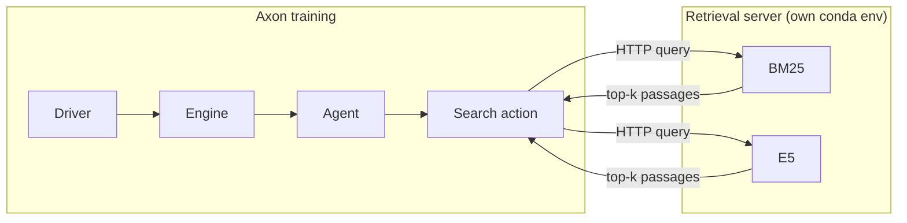

# Search-R1

Search-augmented reasoning. The agent interleaves chain-of-thought (`<think>`) with explicit retrieval calls (`<search>query</search>`), sees the retrieved passages, and ends with `<answer>…</answer>`. Reward is exact-match against ground truth on Natural Questions.

The retrieval server runs as a **separate process in its own conda env** (PyTorch / Faiss version conflicts otherwise); training talks to it over HTTP.

## Files

| File | Purpose |
|---|---|
| `agent.py` | `SearchR1Agent` — parses `<think>` / `<search>` / `<answer>` |
| `env.py` | `SearchR1Env` — dispatches queries to the retrieval server, scores answers |
| `data.py` | Pulls the FlashRAG NQ dataset |
| `retrieval_server.py` | Standalone retrieval server (BM25 sparse, E5 dense) |
| `retrieval_env.yml` | Conda env for the retrieval server |
| `train_fsdp.sh` | Training script (auto-manages the server) |

## Setup

**1. Data**

```bash
cd recipes/search_r1/
python data.py            # FlashRAG NQ → Search-R1 format
```

**2. Retrieval-server conda env** (Python 3.10, NumPy<2, faiss-gpu, pyserini):

```bash
conda env create -f retrieval_env.yml
```

The training script auto-activates this env when it starts the server.

**3. Retrieval index** — pick a retriever:

*BM25 (sparse, CPU, needs Java 21):*

```bash
sudo apt-get install -y openjdk-21-jdk
export JAVA_HOME=/usr/lib/jvm/java-21-openjdk-amd64
hf download PeterJinGo/wiki-18-bm25-index --repo-type dataset --local-dir ~/.cache/bm25_index/wiki-18
hf download RUC-NLPIR/FlashRAG_datasets retrieval-corpus/wiki-18.jsonl.gz --repo-type dataset \
    --revision 5d8dc07e0d2f03784f3fcef665110910375a985b --local-dir ~/.cache/bm25_index/wiki-18
cd ~/.cache/bm25_index/wiki-18 && gunzip -k retrieval-corpus/wiki-18.jsonl.gz && mv retrieval-corpus/wiki-18.jsonl .
```

*E5 (dense) — Flat is exact/GPU, HNSW is approximate/CPU:*

```bash
save_path=~/.cache/e5_index/wiki-18                 # HNSW: ~/.cache/e5_index/wiki-18-hnsw
mkdir -p $save_path && cd $save_path
hf download PeterJinGo/wiki-18-e5-index --repo-type dataset --local-dir .   # HNSW: wiki-18-e5-index-HNSW64
cat part_* > e5_Flat.index && rm -f part_*          # HNSW: cat part_* > e5_HNSW64.index
hf download RUC-NLPIR/FlashRAG_datasets retrieval-corpus/wiki-18.jsonl.gz --repo-type dataset \
    --revision 5d8dc07e0d2f03784f3fcef665110910375a985b --local-dir .
gunzip -k retrieval-corpus/wiki-18.jsonl.gz && mv retrieval-corpus/wiki-18.jsonl .
```

## Run

The script manages the retrieval-server lifecycle (defaults to E5 HNSW, CPU-friendly):

```bash
bash train_fsdp.sh                 # E5 HNSW (default)
bash train_fsdp.sh bm25            # BM25
bash train_fsdp.sh e5-flat         # E5 Flat (GPU)
bash train_fsdp.sh e5-hnsw /path   # custom index path
```

To run the server yourself: activate the `retrieval_server` env and start `retrieval_server.py` (`--retriever_name`, `--index_path`, `--corpus_path`, `--retriever_model`, `--topk`, `--port`); the training script detects a running server. Retriever and index path are chosen by the positional args (`bash train_fsdp.sh [bm25|e5-flat|e5-hnsw] [index_path]`); `E5_MODEL` overrides the embedding model.

## Algorithm

Default model `Qwen/Qwen3-4B-Instruct-2507`; `loss: gspo` (sequence-level; tight clip `0.003` / `0.005`), `advantage: loop`, FSDP, one node. `LOSS_MODE=ppo ./train_fsdp.sh` switches to PPO with the wider `0.2` / `0.28` clip. The tight GSPO clip is intentional — sequence-level objectives need conservative clipping.

## Customize

- **Corpus** — point the server at your own corpus instead of NQ-Wiki.
- **Reward** — `reward.py` scores by exact match (`em_check`).
- **Tag format** — `<think>` / `<search>` / `<answer>` parsing lives in `agent.py`.
- **Multi-hop** — multiple `<search>` calls per rollout are supported; bound cost with `max_turns`.

Retrieval latency dominates — run the server on the same node (over loopback) and warm its cache before training.

## Architecture


